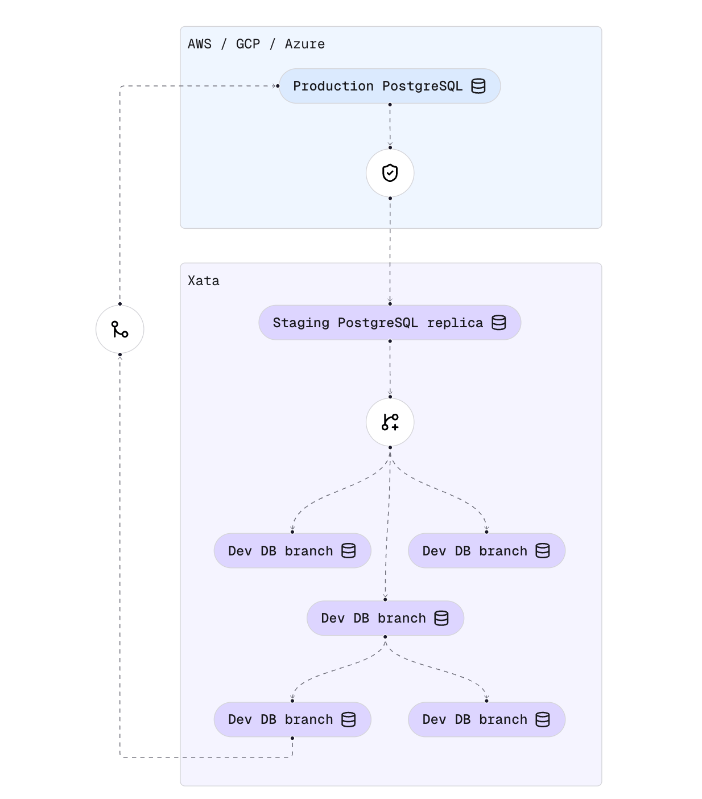
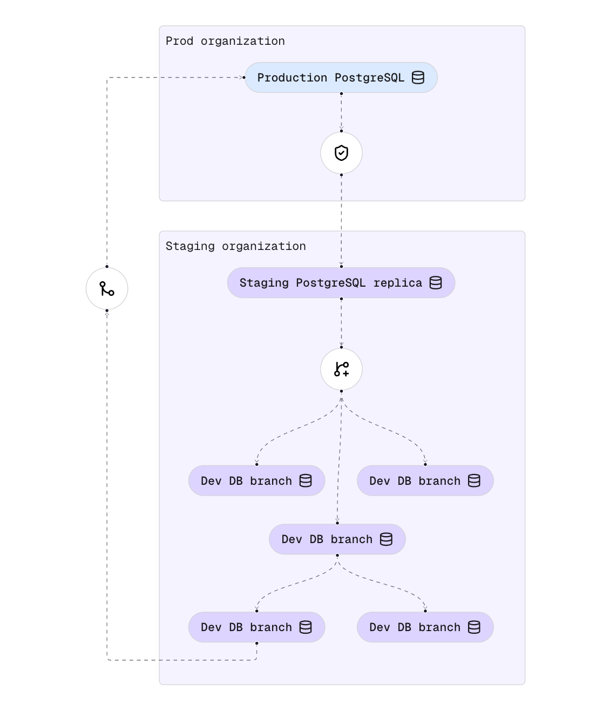
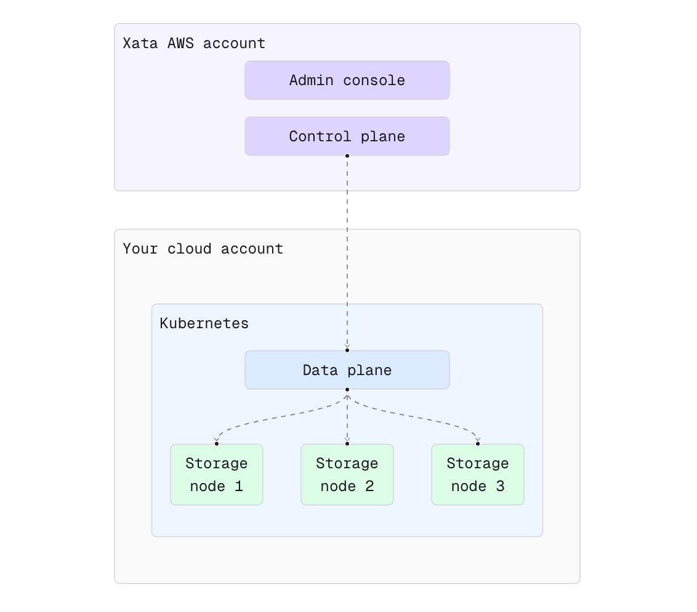

You can use Xata in two major ways:

- **For staging and development use cases**, where you use Xata to enhance other Postgres DBaaS offerings by adding features like instant database branching and data anonymization.
- **For production use cases**, where you run your production Postgres as well as any development branches on our platform.

In either case, you can you can deploy PostgreSQL instances on our cloud, or in your cloud account or even on-prem (BYOC).

## Staging replica and development branches on Xata

In this deployment model, we create a "staging replica" of your production Postgres on the Xata platform. This works with 
any Postgres service (AWS RDS, Amazon Aurora, GCP Cloud SQL, Azure Database, etc.). The staging replica is updated with
the production dataset periodically, for example every night.  We call this process “cloning,” and it is accomplished using our 
open-source CLI (`xata clone`). You can automate the cloning process using GitHub Actions or any other CI/CD tooling.

Anonymization can be done during the cloning phase. Depending on your requirements, you can set anonymization in `strict`
or `relaxed` mode. In `strict` mode, any new table and column needs to be explicitly present in the configuration,
minimizing the chance of accidental leaks.

Because `xata clone` is executed in the context of your environment (e.g. you cloud account), there are two important benefits:

- The tool has access to your production database without requiring changes to your external firewall rules.
- Sensitive data is anonymized before it ever leaves your cloud account.

From the "staging replica", you can create instant branches with all the data, for your development previews, ephemeral environments,
or ad-hoc testing needs.

## Production and development branches on Xata

In this deployment model, you run both production and any staging or development branches you require on the Xata platform. Your production 
branch is typically configured for high availability (with one or multiple read replicas). Development branches generally use a single 
instance and are configured with lower CPU and memory resources to save costs.

If you'd like to set up anonymization between your production and development branches, as well as have stricter controls on who can access production, you can use two Xata organizations. In the production organization you run only the production branch. You can configure `xata clone` to copy and anonymize the data between prod and staging.

## Bring Your Own Cloud (BYOC)

In this deployment model, we install the whole dataplane part of Xata in a Kubernetes setup that you control. This can be in your
own cloud account (AWS, Azure, GCP, Hetzner, etc.) or on-premises. The minimal setup requires three Kubernetes nodes, and there are multiple
installation models (disaggregated, hyper-converged, or hybrid). Our engineers will help you choose the best setup and configure it for you.

This model brings the following benefits:

- **Security, compliance, and data governance.** This setup ensure that all Postgres databases are started in your usual production environment.
- **Better use of your cloud provider credits.** Since you pay for the Kubernetes nodes directly to your cloud provider, you can take advantage fully of your cloud credits, discounts, and negotiated private agreements.
- **Throughput and latency.** Depending on your hardware and networking setup, this deployment model can achieve levels of performance not possible when using a separate cloud account.

The Xata control plane—responsible for managing organizations, users, regions, and instances—continues to run in our AWS account. Latency between 
the control and data planes is not critical, as it involves only control messages (e.g., start/stop instance). By keeping the control plane in 
our account (and optionally also the monitoring/observability data), we can provide you with a managed service similar to what you'd get 
when deploying on our platform.

This setup is especially convenient if you want to offer an internal “Postgres as a service” or if you’re looking to white-label Xata for your customers.

If you have any question regarding BYOC, do not hesitate to write us [an email](mailto:info@xata.io).