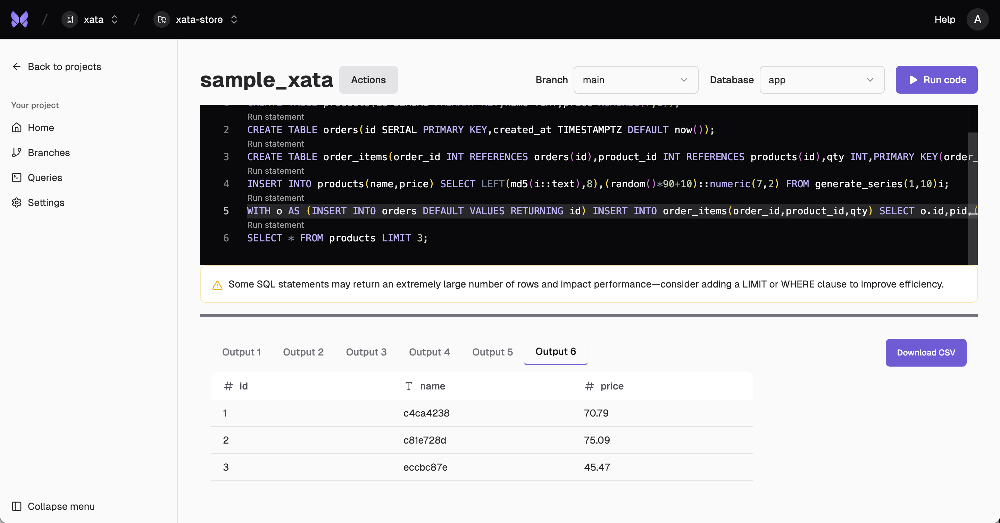

Xata is a PostgreSQL platform that provides instant Copy-on-Write branching, data masking, and separation of storage from compute. It's designed for modern teams running PostgreSQL at scale, with features like zero-downtime schema changes, realistic staging environments, and cloud-agnostic deployment options.

## 1. Sign up

Create your free Xata account at [console.xata.io](https://console.xata.io). You can sign up with GitHub, Google, or your email address.


## 2. Create a project

After signing in, create a new project. A project is the top-level container for all your branches and Postgres instances.


## 3. Create a branch

Within your project, create your first branch (e.g., `main`). A branch is a Postgres cluster—a collection of one or more Postgres instances, which can include a primary and optional replicas. When creating your main branch, you can choose the Postgres version, region, and instance size to fit your needs. This branch can serve as your production branch or a staging environment. You can branch off `main` at any time to create isolated development or test environments.


## 4. Add sample xata (data)

Navigate to the **Queries** section in your project and run the following SQL to create sample tables and data:

```sql
CREATE TABLE products(id SERIAL PRIMARY KEY,name TEXT,price NUMERIC(7,2));
CREATE TABLE orders(id SERIAL PRIMARY KEY,created_at TIMESTAMPTZ DEFAULT now());
CREATE TABLE order_items(order_id INT REFERENCES orders(id),product_id INT REFERENCES products(id),qty INT,PRIMARY KEY(order_id,product_id));
INSERT INTO products(name,price) SELECT LEFT(md5(i::text),8),(random()*90+10)::numeric(7,2) FROM generate_series(1,10)i;
WITH o AS (INSERT INTO orders DEFAULT VALUES RETURNING id) INSERT INTO order_items(order_id,product_id,qty) SELECT o.id,pid,(1+floor(random()*3))::int FROM o,(SELECT id pid FROM products ORDER BY random() LIMIT 5)p;
```



## 5. View your branch schema and enable schema history

Go to the **Branches** section and select your branch (e.g., `main`). Here you can view your schema and enable schema history for zero-downtime migrations.

To enable schema history, install the CLI and initialize your branch:

```bash
curl -fsSL https://xata.io/install.sh | bash
xata auth login
xata init
xata roll init
```


## 6. Create a development branch with the CLI

List your branches:

```bash
xata branch list
```

Grab the `main` branch ID from the list and create a new branch from `main`:

```bash
 xata branch create --name dev --parent-branch [main branch id]
```

## 7. Modify your schema from the terminal

You can make schema changes directly in the Xata query view, but here we'll show how to do it from your terminal using `psql` for a more hands-on workflow.

If you don't have `psql` installed:

**macOS:**
```bash
brew install libpq
echo 'export PATH="/opt/homebrew/opt/libpq/bin:$PATH"' >> ~/.zshrc
source ~/.zshrc
```

**Linux:**
```bash
sudo apt-get install postgresql-client
```

**Windows:**
Download from [PostgreSQL official site](https://www.postgresql.org/download/windows/).

Get your branch connection string using the Xata CLI. First, checkout your new `dev` branch:

```bash
xata checkout dev
```
Then use the connection string to connect with `psql`

```bash
psql `xata branch url`
```

Add a new column to your `products` table:

```sql
ALTER TABLE products ADD COLUMN rating INT;
```

You can now use SQL to update or query the new column.

## 8. Check the schema diff in the branch details page

After making changes in a branch, use the **Schema Diff** feature in the `dev` branch details page to compare your branch with its parent.


## 9. Merge your changes back to main

Now that you've made changes in your dev branch, merge them back to main:

```bash
xata checkout main
xata roll migrate
```

This will apply your dev branch's schema changes to main.

## 10. Start from a clean slate

Now that you're all set up, let's get you reset and ready to start building.

Delete the `dev` branch:

```bash
xata branch delete dev
```

Finally, connect to your main branch using `psql` and run the following SQL to remove the sample tables and data:

```sql
DROP TABLE IF EXISTS order_items;
DROP TABLE IF EXISTS orders;
DROP TABLE IF EXISTS products;
```

This will leave your main branch clean for your next project or migration.

## 11. Next steps: choose your workflow

Now that your environment is clean, you're ready to dive deeper:

- **[Set up staging replica](/tutorials/set-up-staging-replica):** Learn how to use Xata for staging environments, feature branches, and collaborative development.
- **[Migrate to Xata](/tutorials/migrate-to-xata):** Get set up for production by migrating your existing PostgreSQL database to Xata.

---

**Need help?** Reach out to the Xata team at [info@xata.io](mailto:info@xata.io) or join our Discord community.