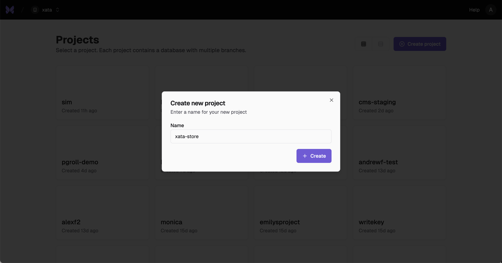
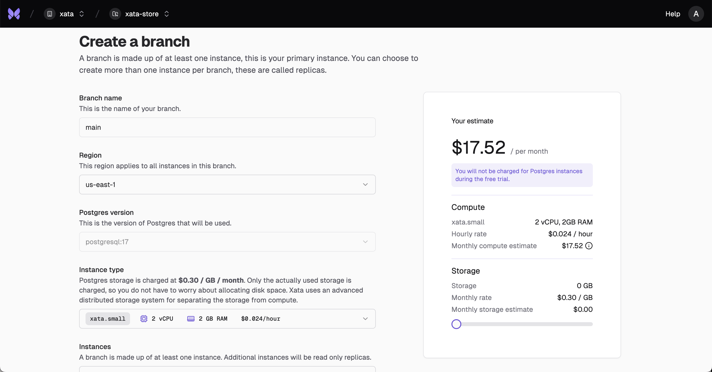
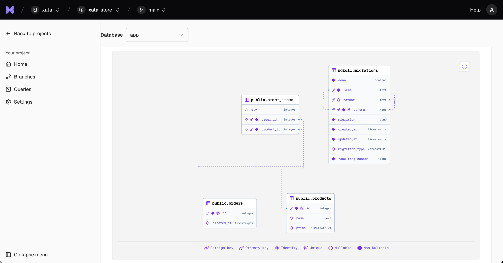
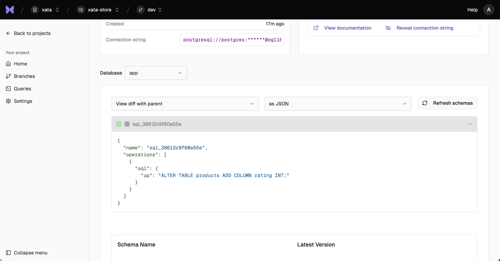

Xata is a PostgreSQL platform that provides instant Copy-on-Write branching, data masking, and separation of storage from compute. It's designed for modern teams running PostgreSQL at scale, with features like zero-downtime schema changes, realistic staging environments, and cloud-agnostic deployment options.

## 1. Sign up

Create your free Xata account at [console.xata.io](https://console.xata.io). You can sign up with GitHub, Google, or your email address.

**Note:** Xata is currently in private beta, please request access and wait for approval before proceeding.


## 2. Create a project

After signing in, create a new project. A project is the top-level container for all your branches and Postgres instances.



## 3. Create a branch

Within your project, create your first branch (e.g., `main`). A branch is a Postgres cluster—a collection of one or more Postgres instances, which can include a primary and optional replicas. When creating your main branch, you can choose the Postgres version, region, and instance size to fit your needs. This branch can serve as your production branch or a staging environment. You can branch off `main` at any time to create isolated development or test environments.



## 4. Install and configure the Xata CLI

Install the Xata CLI:

```bash
curl -fsSL https://xata.io/install.sh | bash
```

Authenticate with your Xata account:

```bash
xata auth login
```

Initialize your project by running this command in your project directory:

```bash
xata init
```

This will create a `.xata` directory with your project configuration.

## 5. Enable schema history

Go to the **Branches** section and select your branch (e.g., `main`). Here you can view your schema and enable schema history for zero-downtime schema changes.



To enable schema history, run:

```bash
xata roll init
```

## 6. Create initial tables

Using `xata roll`, we can now safely create a migration file for our initial schema:

```sh
cat > .xata/migrations/001_initial_schema.yaml << 'EOL'
operations:
  - create_table:
      name: products
      columns:
        - name: id
          type: serial
        - name: name
          type: text
        - name: price
          type: numeric(7,2)
      constraints:
        - name: products_pk
          type: primary_key
          columns:
            - id
  - create_table:
      name: orders
      columns:
        - name: id
          type: serial
        - name: created_at
          type: timestamptz
          default: now()
      constraints:
        - name: orders_pk
          type: primary_key
          columns:
            - id
  - create_table:
      name: order_items
      columns:
        - name: order_id
          type: int
        - name: product_id
          type: int
        - name: qty
          type: int
      constraints:
        - name: order_items_pk
          type: primary_key
          columns:
            - order_id
            - product_id
        - name: order_items_order_id_fk
          type: foreign_key
          columns:
            - order_id
          references:
            table: orders
            columns:
              - id
        - name: order_items_product_id_fk
          type: foreign_key
          columns:
            - product_id
          references:
            table: products
            columns:
              - id
EOL
```

Apply the migration:

```sh
xata roll migrate --complete true
```

## 7. Insert sample data

Let's insert some sample data using `psql`. If you don't have `psql` installed:

**macOS:**

If you are using bash, replace `~/.zshrc` with `~/.bash_profile` in the above.

```bash
brew install libpq
echo 'export PATH="/opt/homebrew/opt/libpq/bin:$PATH"' >> ~/.zshrc
source ~/.zshrc
```

**Ubuntu:**
```bash
sudo apt install postgresql-client-17
```

**Windows:**
Download from [PostgreSQL official site](https://www.postgresql.org/download/windows/).

Connect to `psql` with your dev branch connection string

```sh
psql `xata branch url`
```

Then run the following SQL to insert sample data:

```sql
INSERT INTO products(name,price) SELECT LEFT(md5(i::text),8),(random()*90+10)::numeric(7,2) FROM generate_series(1,10)i;
WITH o AS (INSERT INTO orders DEFAULT VALUES RETURNING id) INSERT INTO order_items(order_id,product_id,qty) SELECT o.id,pid,(1+floor(random()*3))::int FROM o,(SELECT id pid FROM products ORDER BY random() LIMIT 5)p;
```

## 8. Create a development branch with the CLI

Create a new branch from `main`:

```bash
xata branch create --name dev --parent-branch `xata branch get id`
```

This command will automatically checkout the new branch for you.

## 9. Add a column

Let's add a rating column to the products table using pgroll. Create a new migration file:

```sh
cat > .xata/migrations/002_add_rating_column.yaml << 'EOL'
operations:
  - alter_table:
      name: products
      columns:
        - name: rating
          type: int
EOL
```

Apply the migration to your dev branch:

```sh
xata roll migrate
```

This will add the `rating` column to the products table.

## 10. Check the schema diff in the branch details page

After making changes in a branch, use the **Schema Diff** feature in the `dev` branch details page to compare your branch with its parent.



## 11. Merge your changes back to main

Now that you've made changes in your dev branch, you'll need to checkout `main` branch and apply the local migrations from your `dev` branch:

```bash
xata checkout main
xata roll migrate
```

This will apply your dev branch's schema changes to main.

To view the status of the migration:

```bash
xata roll status
```

Once you're happy with the shcema change, you can complete the migration:

```bash
xata roll complete
```

## 12. Start from a clean slate

Now that you're all set up, let's get you reset and ready to start building.

Delete the `dev` branch:

```bash
xata branch delete dev
```

Finally, let's clean up the sample tables using a `xata roll` migration. Create a migration to drop all the tables:

```sh
cat > .xata/migrations/003_cleanup_tables.yaml << 'EOL'
operations:
  - drop_table:
      name: order_items
  - drop_table:
      name: orders
  - drop_table:
      name: products
EOL
```

Apply the cleanup migration:

```sh
xata roll migrate --complete true
```

This will leave your main branch clean for your next project or migration.

## 13. Next steps: choose your workflow

Now that your environment is clean, you're ready to dive deeper:

- **[Set up staging replica](/tutorials/create-staging-replica):** Learn how to use Xata for staging environments, feature branches, and collaborative development.
- **[Migrate to Xata](/tutorials/migrate-to-xata):** Get set up for production by migrating your existing PostgreSQL database to Xata.
- **[Schema changes](/tutorials/schema-change):** Learn how to safely apply and roll back schema changes with zero downtime.

---

**Need help?** Reach out to the Xata team at [info@xata.io](mailto:info@xata.io) or join our Discord community.