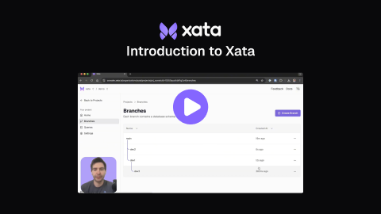

Xata is a modern PostgreSQL platform designed for developers who want to build faster and ship with confidence. Our platform is built to support your production use cases as well as staging environments and developer workflows with  features like instant branching, zero-downtime schema changes, and built-in data anonymization.

Here's a quick introductary video to learn more:

[](https://youtu.be/7P5kyzEfAdc?si=WvSdBDBp95vJM91U)

## Why Xata?

| Feature | Description | Benefit | Learn More |
|---------|-------------|---------|------------|
| **🚀 Instant Branching** | Create database branches in seconds, not minutes | Develop and test with production-like data safely | [Branching Guide →](/core-concepts/branching) |
| **⚡ Zero-Downtime Schema Changes** | Modify your database schema without service interruption | Deploy schema changes with confidence | [Schema Changes →](/core-concepts/schema-changes) |
| **🔒 Built-in Data Anonymization** | Automatically anonymize sensitive data for development | Use real data safely in non-production environments | [Anonymization →](/core-concepts/anonymization) |
| **💰 Scale to Zero** | Hibernate inactive branches to minimize costs | Pay only for active compute time, perfect for development | [Scale to Zero →](/core-concepts/scale-to-zero) |
| **🏗️ Deployment Flexibility** | Choose between SaaS or bring-your-own-cloud (BYOC) | Deploy where you need - managed service or your infrastructure | [Deployment →](/deployment) |

Interested in how we compare against other Postgres solutions out there? Check out this [comparison blog series](https://xata.io/blog/neon-vs-supabase-vs-xata-postgres-branching-part-1) for more details.

## Get Started

Get up and running with Xata in minutes:

1. **[Create your first project](/getting-started)** - Set up a Xata account and create your first database
2. **[Choose your framework](/quickstarts)** - Connect your favorite language or framework

### Popular Quickstarts

| Framework/ORM | Quickstart | Description |
|---------------|------------|-------------|
| **Next.js** | [Get Started →](/quickstarts/nextjs) | Full-stack React applications |
| **Drizzle** | [Get Started →](/quickstarts/drizzle) | TypeScript ORM with type safety |
| **SQLAlchemy** | [Get Started →](/quickstarts/sqlalchemy) | Python SQL toolkit and ORM |
| **Django** | [Get Started →](/quickstarts/django) | Python web framework |

[View all quickstarts →](/quickstarts)

## Tutorials & Guides

| Tutorial | Description |
|----------|-------------|
| **[Set up staging replica](/tutorials/create-staging-replica)** | Create a staging environment with production data |
| **[Schema changes workflow](/tutorials/schema-change)** | Learn best practices for schema evolution |

## Migration Guides

Migrate your existing PostgreSQL databases to Xata using `xata clone`:

| Provider | Migration Guide | Description |
|----------|----------------|-------------|
| **AWS RDS & Aurora** | [Migrate →](/migrations/aws-rds) | Amazon's managed PostgreSQL services |
| **GCP Cloud SQL** | [Migrate →](/migrations/gcp-cloudsql) | Google Cloud's managed PostgreSQL |
| **Azure Database** | [Migrate →](/migrations/azure) | Microsoft's managed PostgreSQL service |
| **Neon** | [Migrate →](/migrations/neon) | Serverless PostgreSQL with branching |
| **Supabase** | [Migrate →](/migrations/supabase) | Open source Firebase alternative |

[View all migration guides →](/migrations)

## Tools & Integrations

### Command Line Interface
Manage your Xata databases directly from the terminal:

```bash
# Install Xata CLI
npm install -g @xata.io/cli

# Authenticate and initialize
xata auth
xata init

# Create and manage branches
xata branch create feature-branch
xata branch checkout main
```

[View all CLI commands →](/cli)

### Automation & CI/CD
Integrate Xata into your development workflow:

- **[GitHub Actions](/automations/ga-pr)** - Create database branches for pull requests
- **[Kubernetes](/automations/kubernetes-clone)** - Deploy with container orchestration

[View all automation workflows →](/automations)

### REST API
Programmatically manage your Xata resources:

- **[Organizations](/api/organizations)** - Manage teams and access
- **[Projects](/api/projects)** - Create and configure databases
- **[Branches](/api/branches)** - Branch management operations
- **[Metrics](/api/metrics)** - Performance and usage analytics

## Get Help

- **[Discord Community](https://discord.gg/xata)** - Join 10,000+ developers
- **[GitHub Discussions](https://github.com/xataio/xata/discussions)** - Ask questions and share solutions
- **[Status Page](https://status.xata.io)** - Check service status
- **[Support](https://xata.io/support)** - Enterprise support and consulting

---

*Built with ❤️ by the Xata team* 